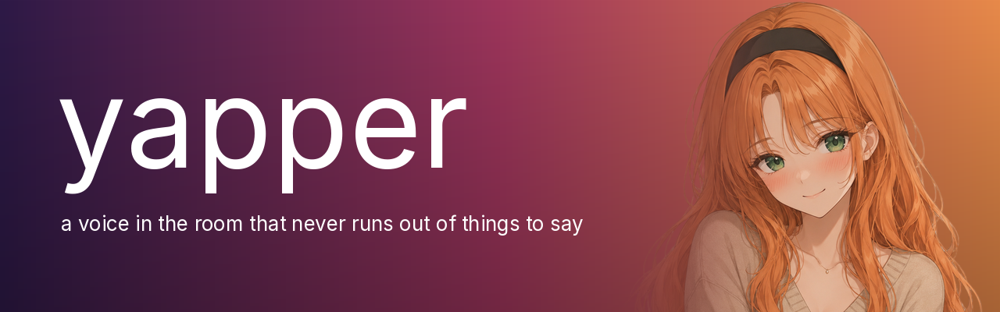

<!--
  BANNER: assets/banner.png, 1280 x 400. GitHub shows it ~1000px wide, so 1280
  keeps it sharp on retina without bloating the repo.

  No <h1> below on purpose — the banner carries the name.

  GitHub strips inline CSS from READMEs, so the colour lives in the image and in
  the badges. The badge hex codes are sampled from the banner gradient
  (violet 2e1a47 -> rose 9e365c -> amber e88a4a); if the banner ever changes,
  change them to match or the header stops looking like one piece.
-->

<div align="center">



<br>

**A voice in the room that never runs out of things to say.**

<br>


</div>

<br>

She tells you about her life. The time a man behind her at the cinema let out an entire
symphony of burps. The kitten she found behind the coffee shop. How she went in for bread
and came out with a cat. None of it happened. She makes all of it up, forever, and she
never stops to think.

> **Oh my gosh, okay wait,** so after the ferret incident (which by the way, did you know
> ferrets can run up to their own body weight? _Insane!_) I decided to take the scenic
> route home since it was such a gorgeous day. Big mistake. Huge.

Start her and she talks until you stop her. She is always mid-story, always delighted
about it, and she is always the same woman — the same voice today, tomorrow, and an hour
from now.

```bash
./yap
```

That's it. Ctrl-C when you've had enough.

<br>

---

## How she works

Two models, running at once on one GPU. One writes, one speaks.

```
   writes  ─────►  speaks  ─────►  you hear it
   (LLM)           (TTS)
     ▲                ▲                ▲
   story 6         story 5          story 4
```

The trick is that she's always a few stories ahead of her own mouth. While you're hearing
one, the next is already recorded and the one after that is already written. So there's no
pause while she thinks — the thinking happened minutes ago. If something goes wrong
mid-sentence, she has about ninety seconds of speech in hand to fix it in, and you never
hear the gap.

Nothing is allowed to stop her. Every part of her can fail on its own and recover on its
own, and the worst case is one story you never got told.

## Who she is

`voice.wav` is her, and once you've made one, it's the one file you can't get back.

Her voice is invented once — the TTS dreams up a woman from the words _"speaking fast
and excitedly, thrilled, like telling a friend amazing news"_ — and every word she has
said since is a copy of that one sample. Ask for a new one and you don't get her back; you
get a stranger. So `voice.wav` isn't in this repo — it's generated on your machine by
`./design-voice` (see below) and gitignored from then on. Back it up yourself once you've
picked her; nobody else has a copy.

If you want to meet someone else, you can. It's the last section of this file.

## Changing her

Everything about her lives in two files.

**`config.toml`** — who she is and what she talks about. **`.env`** — where the models are
on your machine. Nothing else has any settings in it.

A few things worth knowing before you start turning knobs:

**She's a roleplay model, pointed hard away from what it was built for.** The
`NEVER` rules in her prompt look excessive. They are not. Every one of them is there
because she did the thing. Soften them and she'll invent a dead lover and start grieving
about him. Take away _never describe things_ and she stops telling stories and starts
writing a novel at you, all dust motes and golden light. Take away _never use the present
tense_ and she narrates her own life like a sports commentator.

**If she talks too fast or too slow, change `tempo` in `config.toml`.** Don't bother
rewriting her voice description — it decides who she is, not how quickly she speaks.

**If you make a new voice, watch her pitch.** Somewhere around 200–240 Hz she sounds like
a woman in her twenties. Above that she sounds like a child, below it she sounds much
older. Asking for excitement pushes her up toward the child end, which makes _excited but
not childish_ a narrow target — expect to throw a lot of candidates away. The tool prints
the number for you, so you can skip the hopeless ones without listening to them.

## Commands

### Listening

```bash
./yap                  # forever
./yap --seconds 90     # just a taste
./yap --quiet          # don't print what she's saying
```

She needs `llama-server` running and will start it herself if it isn't (about 30 seconds).
It stays up after she stops, so starting her again is instant. `pkill llama-server` frees
the 10 GB when you're done for the day.

### Making a new voice

Only if you want a different woman. This replaces her permanently.

```bash
./design-voice generate     # invent 5 candidates, each a different person
./design-voice play 3       # listen to one
./design-voice choose 3     # keep her
```

`generate` prints each candidate's pitch and speed and tells you which ones read as a
woman rather than a child — skip the rest without listening.

This is the only time the VoiceDesign model runs. It invents a _new_ person on every
single call, so if she used it to speak, she'd be a different woman in every paragraph.
Instead it runs once, you pick one, and from then on she just copies that recording.

### Tests

```bash
.venv/bin/python -m pytest tests/ -q
```

61 tests, about three seconds, no models required — the pipeline is tested with stand-ins,
so you can check she still works without loading 15 GB or waking the speakers.

### Setting it up from scratch

```bash
cp .env.example .env      # then point it at your models
python3 -m venv .venv
.venv/bin/pip install -r requirements.txt
scripts/build-llama.sh    # llama.cpp with CUDA
./yap
```

You'll also need `ffmpeg` and PipeWire. The virtualenv isn't optional — `qwen-tts` insists
on its own versions of torch and transformers.
